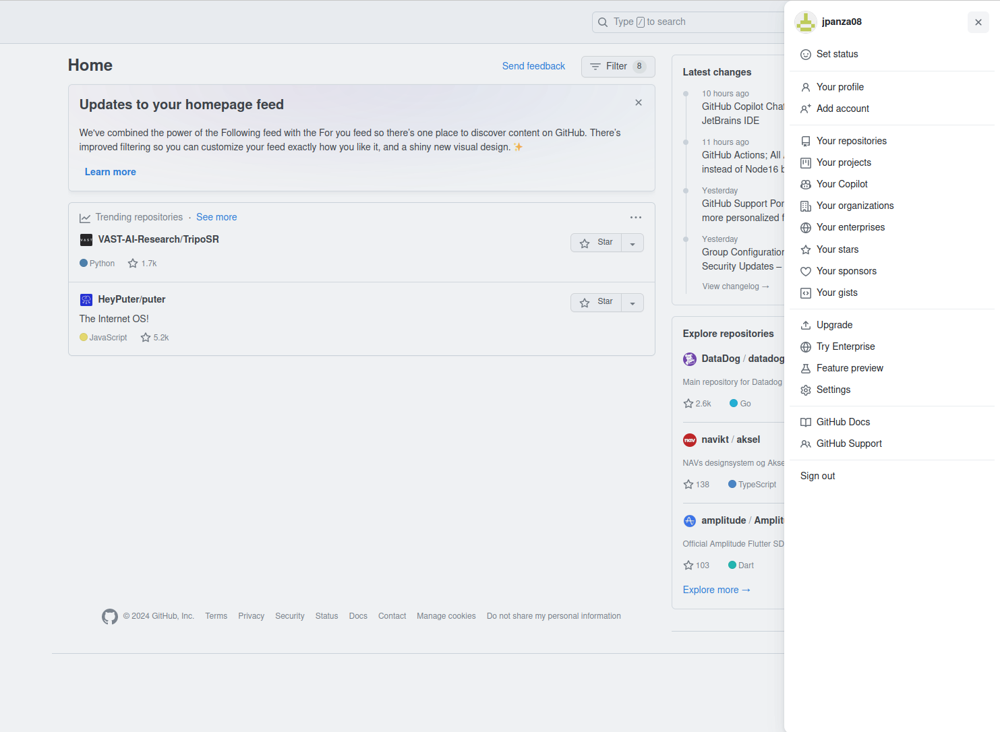
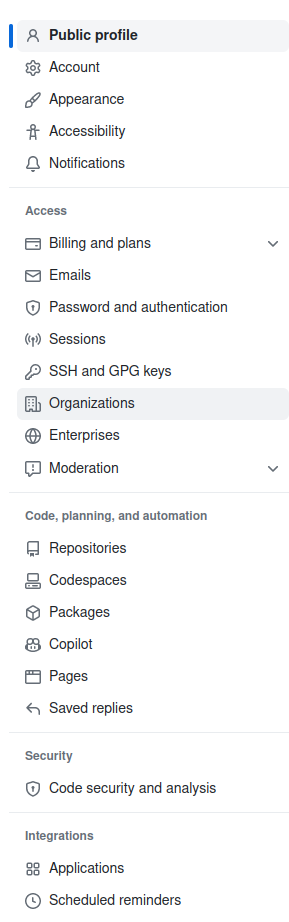
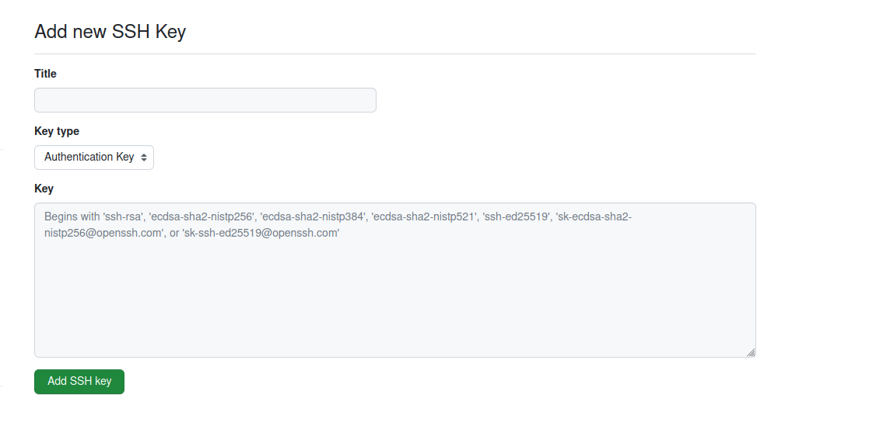

# Git Tutorial 

This tutorial operates under the following assumptions

- OS: Ubuntu or some Linux Flavor 
- Git Version: 2.34.1 or later
- You have created a GitHub account at the following link <href>https://github.com/</href>


## Why Do We Use Git and Where?

Git is a *version control platform*, meaning that it is used to synchronize code changes in the cloud. This could be for multiple reasons, such as an emergency backup or for collaborating with others.

Git is used by 99% of the tech industry, as it is widely supported and allows for a secure way to store code in the cloud where it can be modified and re-uploaded by developers.

## Why Should You Use Git

Git is a clean way to backup code, and it also allows for you to write code from multiple devices. 

As previously mentioned, Git is a tool that will be around for a long time, and it is used by almost every tech company, so its a good skill to have! 


## Installing Git

Open a terminal and type the following commands individually:

The below commands are for updating your package manager, *apt* and for installing the Git-CLI (Command-Line Interface)

```
sudo apt-get update
```
``` 
sudo apt-get install git
```
<!-- ----
The below commands are for configuring your global configuration file: ```~/.gitconfig```.  
Replace your_email with the email you used to create your git account.  
Replace your_name with your name. 
```
git --config user.email your_email
```
```
git --config user.name your name
```

Now you should all of your basic configuration setup, now we are going to work on initializing a repository and setting up your ssh key. -->


## SSH-Key

SSH  (Secure Shell) keys are encrypted keys that are used in order to remotely access secure servers.

This will be the primary method of accessing a remote Git repository.


### Creating an SSH Key Locally

Create a new SSH key

```
 ssh-keygen -t ed25519 -C "your_email@example.com"
```

Press ```enter``` to choose the default file name/location.

Press ```enter``` again to keep a blank password.

Press ```enter``` one last time to confirm this password.

This sequence will create two new files in the ~/.ssh directory: 
``` id_ed25519 ``` (private key) and ```id_ed25519.pub``` (public key).

Start the SSH agent

```
eval "$(ssh-agent -s)"
```

Add your new key to the SSH-agent

```
ssh-add ~/.ssh/id_ed25519
```

### Link SSH Key to Github account

After you have created this SSH key, type the following command and copy the output

```
cat ~/.ssh/id_ed25519.pub
```

Then open a browser and sign into <href>https://github.com/</href>

Once you've signed in, click on your profile in the top right corner and select **Settings**



Once you have selected **Settings**, you will see a page that looks something like this:



Click on **SSH and GPG Keys** and then **New SSH Key**. Your screen should look like this: 



Add your key and name it appropriately.

After this step is done, type the following command **exactly** to authenticate/test your connection.

```
ssh -T git@github.com
```

Type: ```yes```

You should see an ouput that among other things, contains this:

```
Hi <userName>! You've successfully authenticated, but GitHub does not provide shell access.
Connection to github.com closed.
```

If you see a message similar to this, you are all set up, and can move on to the next steps.

## Repositories: the Basics
### Overview

Repositories (repos) are the foundation of git. There are the 'hubs' of code that contain all of the remote branches related to a given project.

Think of them as a remote folder for all of your files.

They live on <href>https://github.com</href>, where they can be either **private** to the creator and select collaborators, or **public** for everyone to see.

If you want to make changes in a given repository, you **can** use the Github Web Editor, but in a large majority of cases, you should clone the repo locally and make changes there instead.

#### There will only ever be one remote instance of a repository, like <href>https://github.com/Azure/azure-cli</href>. But there can be an infinite number of clones of a repo. ####

This may not make sense right now, but it will soon, I promise!


## Branches

<!-- Branches are one of the two main concepts of Git. -->

In every repository, there is a **primary branch**, sometimes called the **main** or **master** branch, varying from repository to repository. 

Picture a branch as a horizontal line, with a plethora of dots plotted on it. Each dot on the branch is called a **commit**. Commits are simply code changes that are added to the end of a given branch. All of the code changes ever made in a repository are reflected in branches.

**You can (and should) branch off of the primary branch.** Your branch originates from a given commit in a repository and runs **parallel to the primary branch.** Doing this allows you to make changes to the code base without them being made in the primary branch, while still keeping up with the changes made in the primary branch. **You can experiment with your changes and test them separately from the primary branch, on your own branch.**

By default, you will be on the **primary branch** of a given repo, and the name of this branch will vary depending on the repo you are working on. The two most common names are **main** and **master**.

Check what branch you are on at any time with the following command: 

```
git branch
```

The output will look something like this: 

```
* master
```
The '*' is a reference to which branch you currently have checked out.

You can create a new branch with the following command:

```
git branch <branchName>
```

Note that this will create a branch off of the current branch you are on, carrying over all of the previous changes.

You then need to "check out" the branch, switching your local file structure and files to match the branch, so your changes and future commits affect your new branch as opposed to the primary branch. You can do so with the following command.

```
git checkout <branchName>
```
Return to the primary branch at any time with the command:

```
git checkout <primaryBranchName>
```

Note that there are two types of branches, **local branches** and  **remote branches**. Local branches are simply that, local to your machine, and they can be linked to remote branches. Remote branches are located on the GitHub servers, and contain the changes that you push to them.

As mentioned before, you can interact with branches in many different ways. Below are the basics.

### Adding

When you make changes locally, they will be reflected in your local environment.

Type the following command from any location within your local copy of the repository, to view the files that have been changed:
```
git status
```

In order to push your changes to the remote version of your branch, you first need to create a commit. Before you can create a commit you need to specify which files you want to be included in the commit package that will be pushed to the remote branch.

Once you see which files you have changed with the previous command, you can now add them to the commit with the following command:

```
git add <filePath>
```

Note the file path will vary based on where your terminal is pointing within the repo. 

Alternatively, if you want every file you have changed to be included in the commit, move your terminal to the root of the repository and enter the following command:

```
git add .
```

This is a special instance of the add command. Recall that ```.``` within the terminal refers to the current directory. 

Here the ```git add``` command will select every **changed** file in the current directory and sub-directories, and add them to the commit bundle to be sent to the remote.

### Committing

After you have added the files you want to include in your commit bundle, you can finish up the commit by adding a message to the bundle that goes up to the remote. 


## Creating a Repo

You can either create the local or remote repo first, but either way, you need to have the two created in order to link them.